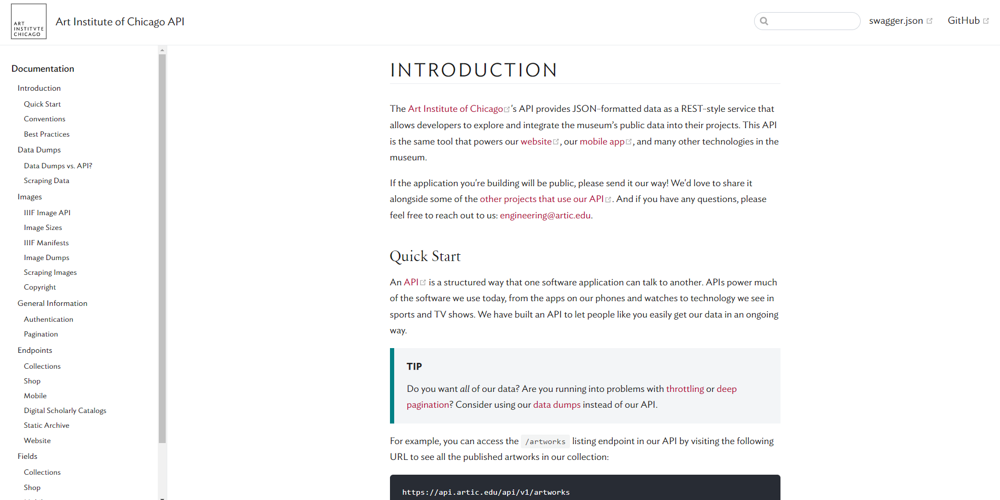
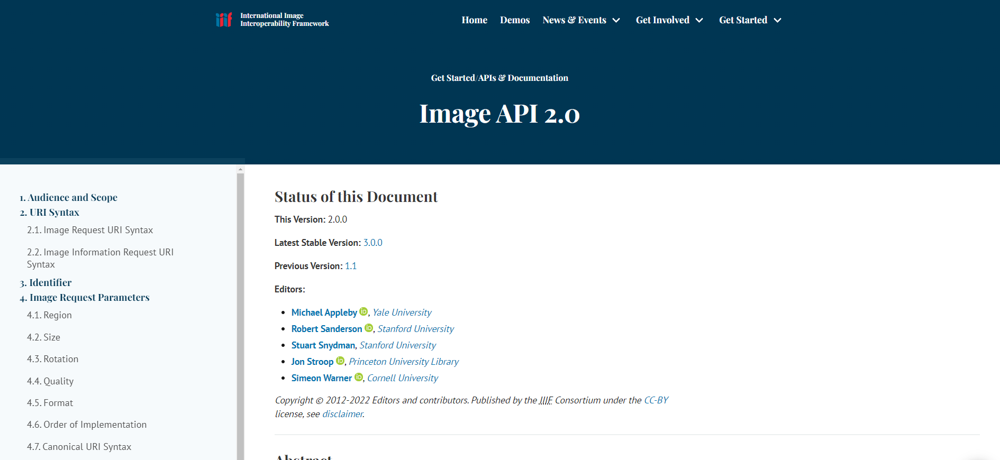
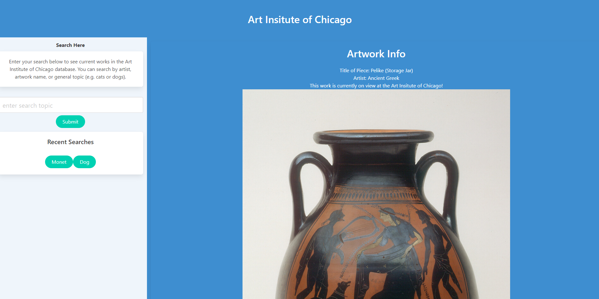
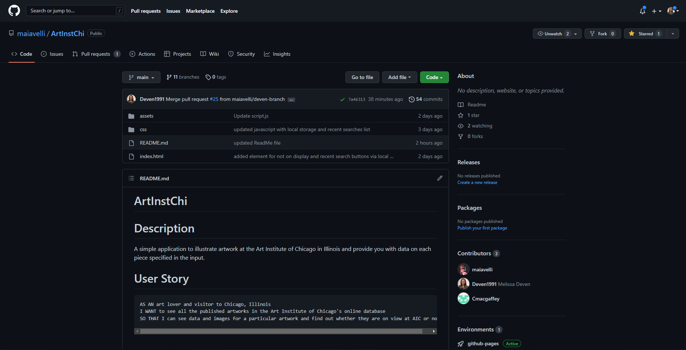

# ArtInstChi

## Description

A simple application to illustrate artwork at the Art Institute of Chicago in Illinois and provide you with data on each piece specified in the input. 

- Project Motivation: As local Midwesterns, the group found the API on local Art Institute information and artwork fascinating. The museum houses a collection that spans centuries and the globe.
- We built this project as a way of exploring artwork by any general search for ease of use.

## Table of Contents

Below is a table of contents to make it easy for users to find what they need.

- [User Story](#UserStory)
- [Usage](#Usage)
- [Features](#Features)
- [APIs Used](#APIsUsed)
- [Credits](#Credits)
- [Important Links](#ImportantLinks)


## UserStory
```
AS AN art lover and visitor to Chicago, Illinois
I WANT to see all the published artworks in the Art Institute of Chicago's online database
SO THAT I can see data and images for a particular artwork and find out whether they are on view at AIC or not
```


## Usage
```
GIVEN THAT I open the app
WHEN I enter an artist name, artwork name, or general search topic
THEN I am met with a selection of 10 artworks relevant to that search
WHEN my search is completed
THEN I can see the name of the artworks, the artist's names, images of those works, and whether it is currently on display at the museum
WHEN I enter a subsequent search
THEN I want my webpage to refresh and show only most recent search
```

## Features

- Bulma: Free, open-source framework that provides ready-to-use frontend componenets that can easily combine to build responsive web interfaces. Bulma was integrated into this webpage as an alternate CSS framework.

- Recent Searches Button: In a left panel on the webpage, there is a "Submit" button that saves the search history under "Recent Searches."

- Local Storage: The recent searches listed above are also saved in local storage.


## APIsUsed 

- Art Institute of Chicago API: https://api.artic.edu/docs/


- Artwork Images API: https://iiif.io/api/image/2.0/
 


## Credits

List of collaborators in alphabetical order with links to GitHub profiles. 

- Maia Davis: https://github.com/maiavelli
- Melissa Deven: https://github.com/Deven1991
- Colin MacGaffey: https://github.com/cmacgaffey


## ImportantLinks

Deployed URL: https://maiavelli.github.io/ArtInstChi/
 

Repo: https://github.com/maiavelli/ArtInstChi.git
 
